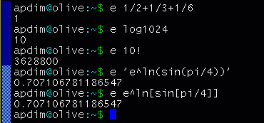

a tiny expression evaluator
-
about e
-
Some time ago while I was doing some homework for my university class, I needed a quick way to evaluate expressions, while I was typing at the command prompt. I found two solutions, using bc or gnuplot. bc has fixed precision which defaults to 0, so to evaluate an expression involving decimal results you need to issue a command like "scale=5" beforehand. On the other hand using gnuplot (and bc if it matters) involves loading the executable, evaluating your expression using the "print" command and quitting using the "quit" command. I needed something quicker..

...so, I coded e.

e is a command line expression evaluator. It was designed to be as small as possible, and quick to use. Therefore the name "e" was chosen, so that while you are at the command prompt you can evaluate an expression with only 2 keystrokes overhead. e manages to be under 8k in size on most compilers that I tried. My current record is 7000 bytes for v0.02718.

screenshot
-
Here is a screenshot of e doing some typical calculations. It shows some but not all of the features. For more information see the README file.

download e
-
    source code
    e-0.02718.tar.gz (14k)
    executable for linux and glibc 2.1
    e (7000 bytes)

history
-
> Jul 11 2001: Version 0.02718
>    - first public release
